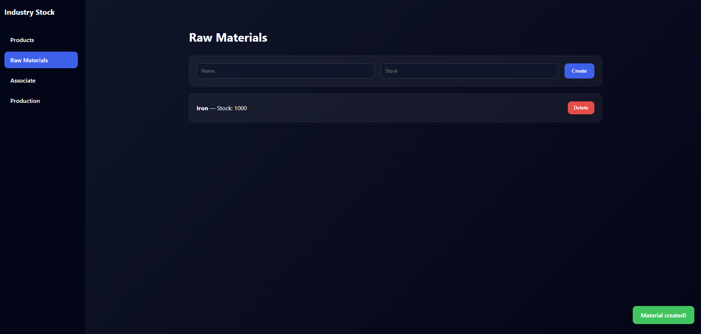
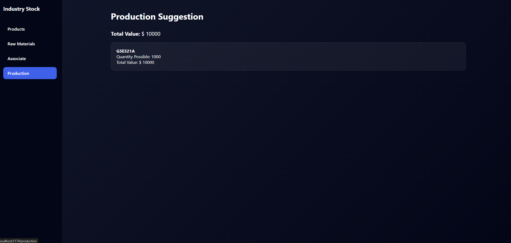

# 📦 Industry Stock Control

Sistema completo para controle de estoque industrial, permitindo o gerenciamento de produtos e matérias-primas com sugestões de produção baseadas na disponibilidade do estoque.

# 🚀 Tecnologias

## Backend

- Java 17
- Quarkus
- Hibernate / Panache
- PostgreSQL (ou H2)
- REST API

## Frontend

- React
- Vite
- Axios
- Context API
- Hooks

# 🧠 Arquitetura

O projeto foi dividido em duas aplicações:

- backend → API REST
- frontend → Interface do usuário

O frontend consome os endpoints expostos pelo backend.

# ⚙️ Como rodar o projeto

## 🔵 Backend

Entre na pasta:
- backend
Execute:
- ./mvnw quarkus:dev
API disponível em:
- http://localhost:8081

## 🟣 Frontend

Entre na pasta:
- frontend
Instale dependências:
- npm install
Execute:
- npm run dev
Aplicação disponível em:
- http://localhost:5174

## 🔐 Variáveis de ambiente

- Este projeto utiliza variáveis de ambiente para configuração.
- Crie um arquivo .env com base no exemplo: 
- cp .env.example .env
- Ou copie manualmente os valores do arquivo .env.example
⚠️ O arquivo .env não é versionado por segurança.

## 🔥 Funcionalidades

- ✅ Sistema de gestão de estoque com motor de sugestão de produção baseado em disponibilidade de insumos.
- ✅ Exclusão com confirmação
- ✅ Feedback visual com Toast
- ✅ Tratamento global de erros

## 📌 Melhorias futuras

- Autenticação com JWT
- Dashboard com métricas
- Testes automatizados
- Dockerização
- Deploy cloud

### 👨‍💻 Autor

- Douglas Mendes Vieira
- Desenvolvedor Full Stack
- Java • React • Vue • APIs • Arquitetura
- LinkedIn: [https://www.linkedin.com/in/douglasmv/]
- WhatsApp: (31) 98796-8023

## 📸 Preview

### Produtos

### Matérias-primas

### Sugestão de produção
